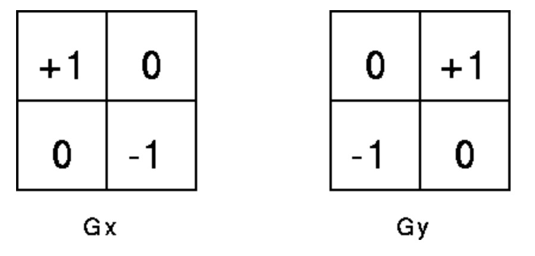

# Facial Expression Recognition

# Expression Recognition - Short overview
1. We are given an image containing a face.

2. We classify the face in image to be happy or sad or angry etc..

3. Our images are 50 X 50 in size.

4. We use 'compact embedding' to extract important Features out of the image

5. We then use this as a 'Feature Vector' for data.

6. We train the model using SVM.

7. We then print the accuracy score for test data.

# Sample Image

# Embeddings

We try two different embeddings:
1. Edge detection algorithm.
2. Uniform Local Binary Pattern Histogram

# Edge Detection

Edges are significant local changes of intensity in a digital image.

Initial image:

## Edge detection: Robert Cross Edge detector
1. The Roberts Cross operator performs a simple, quick to compute, 2-D spatial gradient measurement on an image. It thus highlights regions of high spatial frequency which often correspond to edges.

2. In theory, the operator consists of a pair of 2×2 convolution kernels as shown in Figure 1. One kernel is simply the other rotated by 90°. 

3. We apply this convolution using scipy's convolve2d to each pixel

# Local Binary Pattern Histogram:

Local Binary Pattern (LBP) is a simple yet very efficient texture operator which labels the pixels of an image by thresholding the neighborhood of each pixel and considers the result as a binary number.

## Procedure:

## Now we explain How ULBPH captures facial data.

1. Edges in images are high chage in pixel values in one direction relative to the current pixel.

2. Below diagram explains how LBP captures textures of data.

3. Black circle represents low value pixel (~0).

4. White circle represents high value pixel (~250).

## Image before LBPH filter

## Result after LBPH filter

# Results

We apply the above transformations to each image (when needed) and train using SVM, XG Boost etc..

## We obtain around 60% accuracy (7 class SVM) on test set using traditional ML
## For more info read main.ipynb

# Todo

1. Use Neural Networks